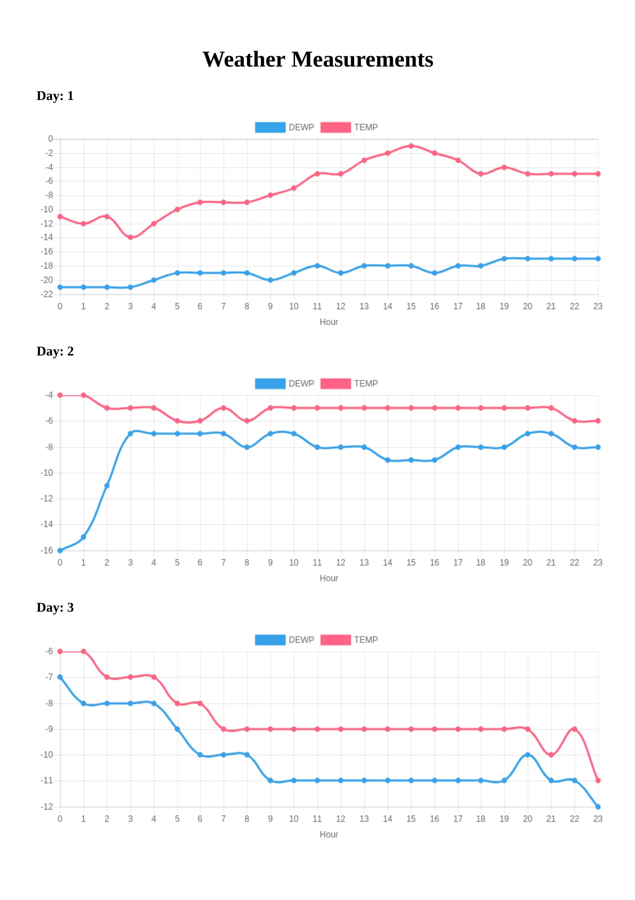

IoT Analytics - Data Visualization
================================

Developing online analytic and visual reports for IoT sensor data is of great interest for IoT businesses. This python web app shows how to implement a single web application to read the weather measuremnt data from a data source and plot it in several dynamic charts. The application uses Flask package to create a web page and Chart.js to draw the charts. The charts' data is based on part of [Air Quality dataset](https://archive.ics.uci.edu/ml/datasets/Beijing+PM2.5+Data). Only Dew Point (DEWP) and temperature (TEMP) are considered for the presentation in the charts. Each chart shows the trend of TEMP and DEWP in a specific day over 24 hours.  

Requirements:
---------------

- numpy
- pandas
- flask

How To Run:
------------

1. $ python app.py
2. In the browser, go to http://127.0.0.1:5000/
  
 

